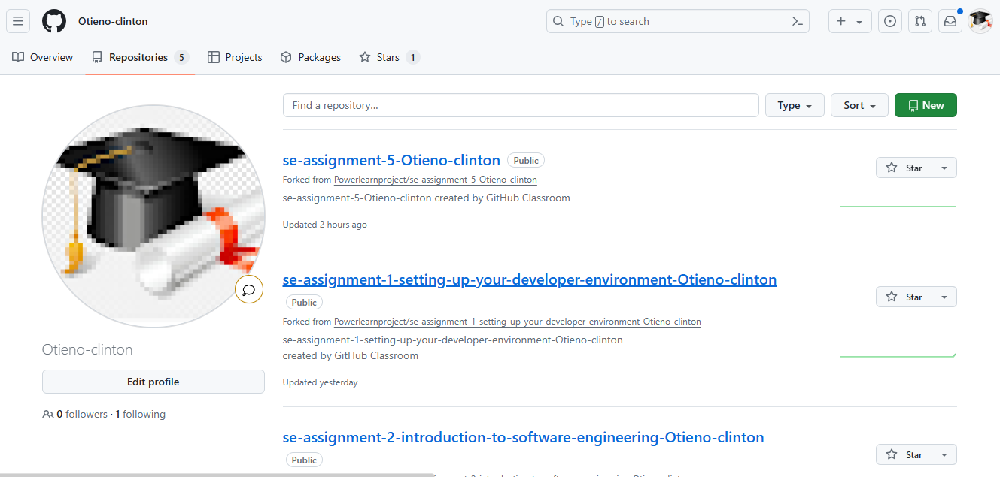
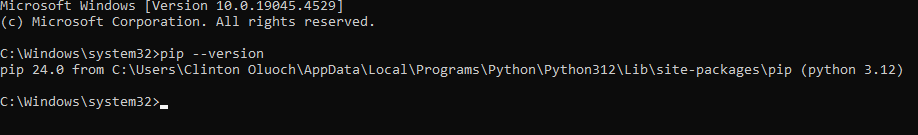
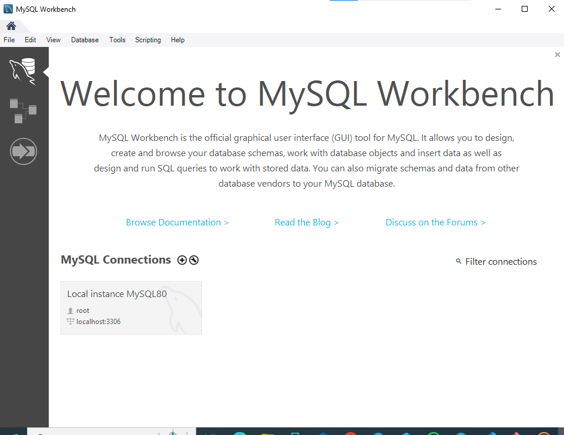
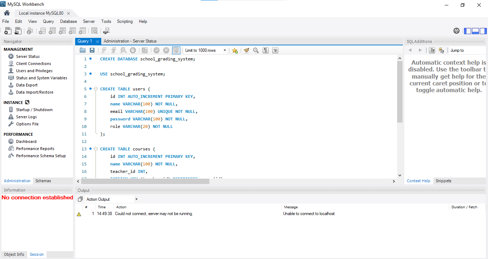
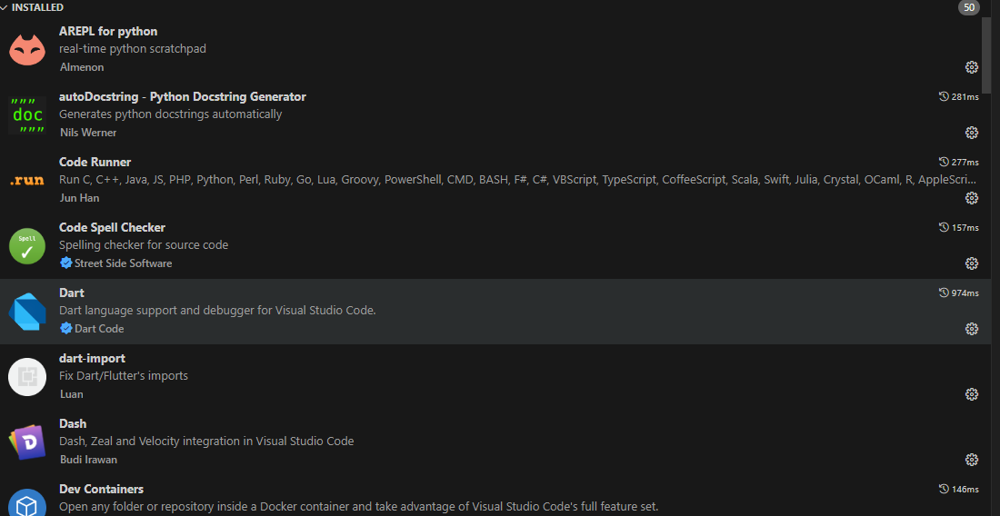
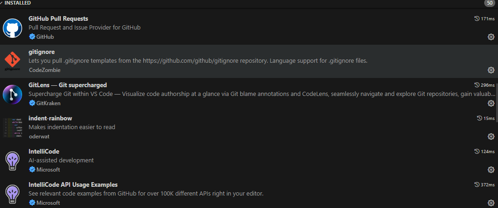
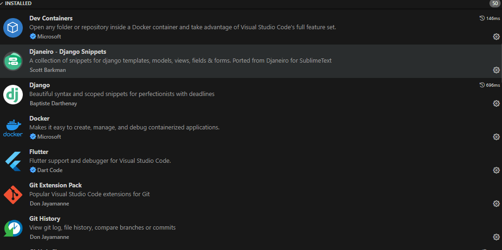

# Dev_Setup
Setup Development Environment

#Assignment: Setting Up Your Developer Environment

#Objective:
This assignment aims to familiarize you with the tools and configurations necessary to set up an efficient developer environment for software engineering projects. Completing this assignment will give you the skills required to set up a robust and productive workspace conducive to coding, debugging, version control, and collaboration.

#Tasks:

1. Select Your Operating System (OS):
   Choose an operating system that best suits your preferences and project requirements. Download and Install Windows 11. https://www.microsoft.com/software-download/windows11

PROCEDURE FOR INSTALLING WINDOWS 11:
   a) Check Compatibility: Ensure your PC meets the minimum system requirements for Windows 11.
   
    b) Backup Data: Backup all important files and data.
    
    c) Create Windows 11 Installation Media: Download the Windows 11 Media Creation Tool from Microsoft’s official website and use it to create a bootable USB drive.
    
    d) Boot from USB: Insert the USB drive into the PC, restart it, and enter the BIOS/UEFI settings to set the USB drive as the primary boot device.
    
    e) Install Windows 11: Follow the on-screen instructions to install Windows 11. Choose your preferences, accept the license terms, and select ‘Custom: Install Windows only (advanced)’ for a clean install.

    f)  Partition Drives: If needed, partition your drives during installation.
    
    g)  Complete Setup: After installation, remove the USB drive and complete the out-of-box experience setup by creating or signing into a Microsoft account, setting up a PIN, and customizing settings.

2. Install a Text Editor or Integrated Development Environment (IDE):
Select and install a text editor or IDE suitable for your programming languages and workflow. Download and Install Visual Studio Code. https://code.visualstudio.com/Download

    HOW I INSTALLED VS CODE:
    Title: Installation Guide for Visual Studio Code in my Windows
    
    
    
    Procedure:
    
    Download VS Code:
    
    Visit the official Visual Studio Code website at https://code.visualstudio.com/.
    Click on the download link for your operating system which is windows for my case.

    Install VS Code:
    Windows:
    Run the downloaded installer.
    Accept the agreement and choose the installation options.
    Follow the prompts to complete the installation.
    
    Launch VS Code:
    Open VS Code from the Start menu (Windows)
    Optional Configurations:
    Customize settings, install extensions, and configure themes as per your preference.
    

3. Set Up Version Control System:
   Install Git and configure it on your local machine. Create a GitHub account for hosting your repositories. Initialize a Git repository for your project and make your first commit. https://github.com

        Title: Git Installation and Configuration for Windows Os.
        
        Introduction: Git is a distributed version control system used for tracking changes in source code during software development.
        
        Procedure:
        
        Download Git:
        Visit the official Git website at https://git-scm.com/downloads.
        Click on the download link for your operating system and I choose window.
        
        Install Git:
        Windows:
        Run the downloaded installer.
        Follow the prompts, choosing the default settings or customizing as needed.
        
        Configure Git:
        Open a terminal or command prompt.
        Set your global username with git config --global user.name "Your Name".
        Set your global email with git config --global user.email "your_email@example.com".
        
        Verify Installation:
        Check the Git version with git --version to ensure it’s installed correctly.
            c:\Users\Clinton Oluoch\Pictures\Camera Roll\git.png

        
        GitHub Account Creation and Repository Initialization:
        
        
        Procedure:
        
        Create a GitHub Account:
        Visit https://github.com.
        Click on “Sign up” and fill in the required information.
        Verify your email address to complete the account setup.
        
        Initialize a Git Repository:
        Create a new directory for your project or navigate to an existing one.
        Open a terminal or command prompt in this directory.
        Run git init to initialize a new Git repository.
        
        Make Your First Commit:
        Add files to the repository with git add . (the period adds all files).
        Commit the changes with git commit -m "Initial commit".
        
        Connect to GitHub:
        Go back to GitHub and click on “New repository”.
        Name your repository and click “Create repository”.
        Follow the instructions to push an existing repository from the command line, which will include:
        Setting the remote URL with git remote add origin https://github.com/username/repository.git.
        Pushing your commit with git push -u origin master.
            

    

4. Install Necessary Programming Languages and Runtimes:
  Instal Python from http://wwww.python.org programming language required for your project and install their respective compilers, interpreters, or runtimes. Ensure you have the necessary tools to build and execute your code.

        Title: Python Installation and Environment Setup Guide
        
        
        Procedure:
        
        a. Download Python:
        Visit the official Python website at https://www.python.org/downloads/.
        Click on the download link for the latest version of Python.
        
        b. Install Python for windows:
        
        Windows:
        Run the downloaded installer.
        Make sure to check “Add Python to PATH” before installation.
        Follow the prompts to complete the installation.
        
        c. Verify Installation:
        Open a terminal or command prompt.
        Run python --version to check if Python is installed correctly.
         c:\Users\Clinton Oluoch\Pictures\Camera Roll\python.png

        
        d. Set Up Execution Environment:
        Install pip, Python’s package installer, if not included.
        Use pip to install any required libraries or frameworks for your project with pip install package_name.

5. Install Package Managers:
   If applicable, install package managers like pip (Python).

        Title: Python Package Managers Installation:
        
        Introduction: Package managers are tools that automate the process of installing, upgrading, configuring, and removing software packages.
        
        Procedure:
        
        Install pip (Python’s package installer):
        
        Windows:
        Python comes with pip by default. You can upgrade it using python -m pip install --upgrade pip in the command prompt.
        
        Verify Installation:
        Use pip --version, to confirm the installation.
            

6. Configure a Database (MySQL):
           Download and install MySQL database. https://dev.mysql.com/downloads/windows/installer/5.7.html
        
        Title: MySQL Database Installation Guide
        
        
        Procedure:
        
        Download MySQL Installer:
        Visit the MySQL downloads page at https://dev.mysql.com/downloads/windows/installer/5.7.html.
        Choose the version that suits your system and mine is 64-bit (32-bit or 64-bit).
        Click “Download” and start the download process.
        
        Install MySQL:
        Run the downloaded installer.
        Select the setup type (e.g., “Full”, “Custom”, “Server only”).
        For a custom installation, choose the components you wish to install.
        Click “Next” and proceed with the installation.
        
        Configure MySQL Server:
        Choose the configuration type (e.g., “Development Machine”, “Server Machine”, “Dedicated Machine”).
        Set the root password and create user accounts if necessary.
        Configure the server settings, such as port number and Windows Service options.
        
        Complete Installation:
        Review the configuration and click “Execute” to apply the settings.
        Once configuration is complete, click “Finish”.
        
        Verify Installation:
        Open MySQL Workbench or another client tool.
        Connect to the MySQL server using the root credentials to ensure it’s running properly.
            
            

7. Set Up Development Environments and Virtualization (Optional):
   Consider using virtualization tools like Docker or virtual machines to isolate project dependencies and ensure consistent environments across different machines.
       
8. Explore Extensions and Plugins:
   Explore available extensions, plugins, and add-ons for your chosen text editor or IDE to enhance functionality, such as syntax highlighting, linting, code formatting, and version control integration.

          

9. Document Your Setup:
    Create a comprehensive document outlining the steps you've taken to set up your developer environment. Include any configurations, customizations, or troubleshooting steps encountered during the process. 

        I HAVE DOCUMENTED EVERY SETUP IN THE QUESTIONS ABOVE.

#Deliverables:
- Document detailing the setup process with step-by-step instructions and screenshots where necessary.
- A GitHub repository containing a sample project initialized with Git and any necessary configuration files (e.g., .gitignore).
- A reflection on the challenges faced during setup and strategies employed to overcome them.

#Submission:
Submit your document and GitHub repository link through the designated platform or email to the instructor by the specified deadline.

#Evaluation Criteria:**
- Completeness and accuracy of setup documentation.
- Effectiveness of version control implementation.
- Appropriateness of tools selected for the project requirements.
- Clarity of reflection on challenges and solutions encountered.
- Adherence to submission guidelines and deadlines.

Note: Feel free to reach out for clarification or assistance with any aspect of the assignment.
